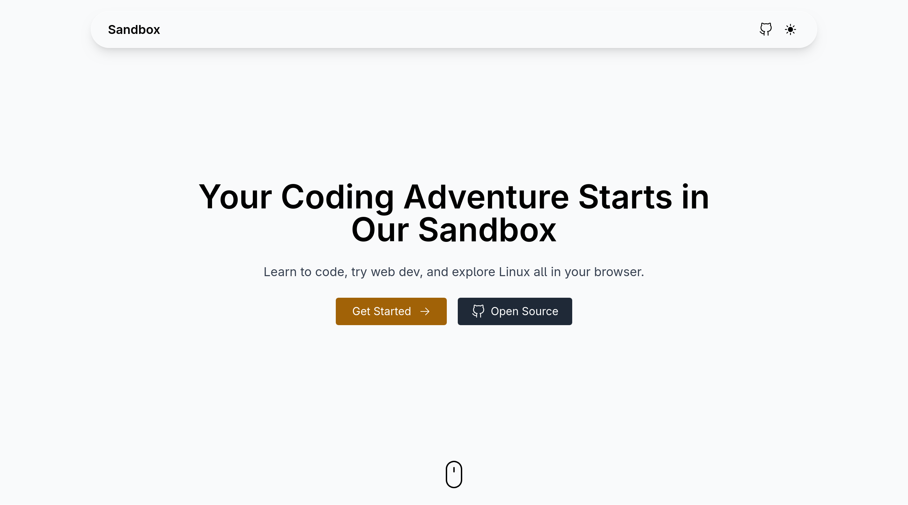
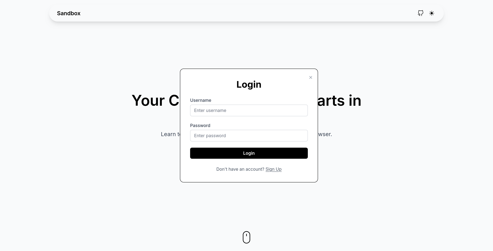
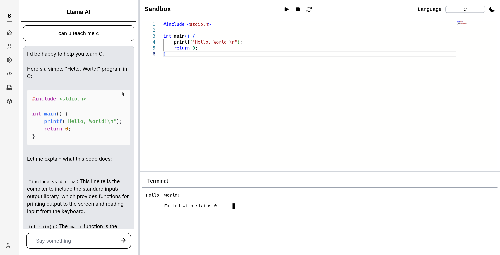
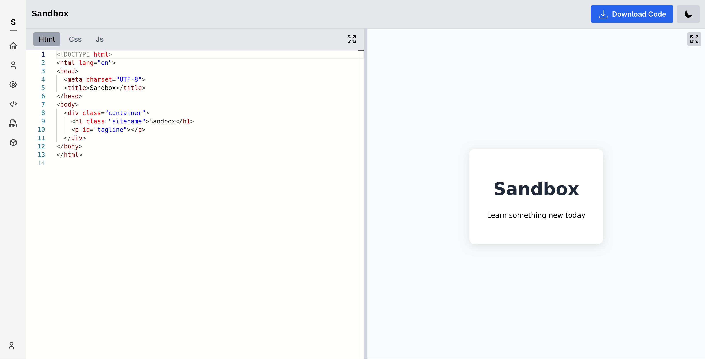

 # Sandbox - Secure Online Coding Platform

 A web-based frontend interface for writing, editing, and securely executing code in a sandboxed environment.
 This interface integrates a real-time terminal, AI-driven programming guidance, and syntax-aware code editing.

 ## Overview
 This repository contains the frontend implementation of a secure online code execution system.
 It provides users with an intuitive interface to write, compile, and run code in a safe environment.
 The system uses Monaco Editor for editing, Xterm.js for terminal emulation, and WebSocket for real-time communication.

 |  |  |  | |
|----------------------------------|-----------------------------------|--------------------------------------------------------|--------------------------------------------------------|

 ## Features
 - Code Editing: Monaco Editor with syntax highlighting, code suggestions, and inline error detection.
 - Terminal Emulation: Xterm.js for interactive, real-time execution output.
 - AI Assistance: Integrated chatbot powered by LLAMA-3.2 offering help with debugging, explanations, and suggestions.
 - Real-time Communication: WebSocket support for live code execution and response handling.

 ## Installation Steps
 1. Clone the Repository:
    ```bash
    git clone https:github.com/foskey51/sandbox.git
    cd sandbox
    ```

 2. Install Dependencies:
    Ensure Node.js and npm are installed, then run:
    ```bash
    npm install
    ```

 3. Run the Application:
    Start the development server:
    ```bash
    npm run dev
    ```

    The app will be available at http:localhost:5173 (or your configured port).

 ## Online Linux VM (Coming Soon)
 An integrated online Linux VM is planned for future releases to support practical, hands-on learning experiences.

 ## Notes
 - This repository only contains the frontend interface.
 - Ensure that the [**backend**](https://github.com/foskey51/sandbox-backend) is up and running.
 - AI chatbot functionality depends on integration with a [LLAMA-3.2](https://ollama.com/library/llama3.2) compatible model.

 ## Contributing
 Contributions are welcome!
 Please open a pull request or file an issue to suggest improvements, report bugs, or propose features.

 ## License
 This project is licensed under the MIT License.
 See the LICENSE file for details.
